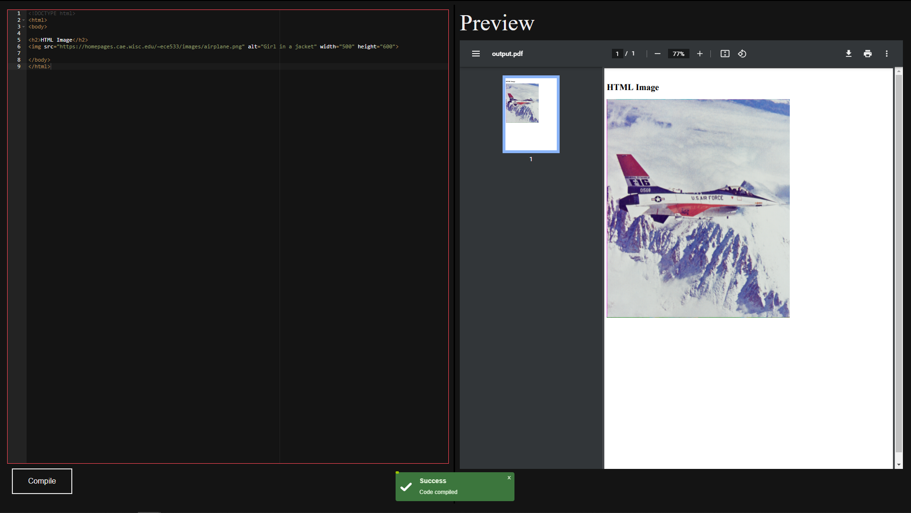

# html-to-pdf

Create PDF file from html

## Installation

Use the package manager [npm](https://www.npmjs.com/) to install the dependencies.

```
npm install
```

## Target

To create a simple tool to create and preview PDF document from html code

## Dependencies / Features

- [Puppeteer](https://github.com/puppeteer/puppeteer)
- [Express](https://github.com/expressjs/express)
- [Nodemon](https://github.com/remy/nodemon)
- [Ace (Ajax.org Cloud9 Editor)](https://github.com/ajaxorg/ace)


## Screenshot



## Roadmap

- [x] Create PDF file from input html
- [x] UI to input html
- [x] UI to Preview PDF


## License

[MIT](https://choosealicense.com/licenses/mit/)
